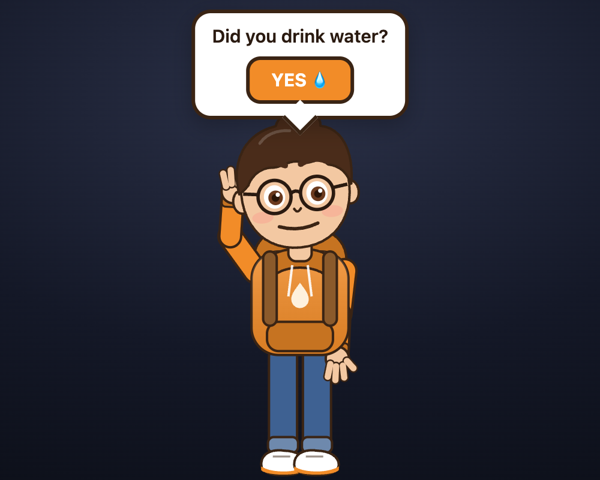

<p align="center">
  
</p>

<h1 align="center">PixelFriend</h1>

<p align="center">
  A tiny cartoon buddy who lives in VS Code and your macOS menu bar, asks <em>"Hi, do you have water?"</em> every hour, and celebrates when you say yes.
</p>

<p align="center">
  <a href="#quick-start">Quick start</a> ·
  <a href="#what-it-does">What it does</a> ·
  <a href="#how-it-is-built">How it is built</a> ·
  <a href="#settings">Settings</a> ·
  <a href="#development">Development</a>
</p>

---

## Why

Developers forget to drink water. Calendar pings and phone alarms are easy to dismiss and easy to resent. PixelFriend tries the opposite approach: a small, friendly character who asks politely, waits for you, and is visibly happy when you take a sip. Positive reinforcement, no nagging, no guilt.

## What it does

| | |
|---|---|
|  | **A cartoon buddy in VS Code.** He lives in the sidebar, breathes, blinks, looks around, and keeps a countdown to the next reminder under his feet. |
|  | **He asks out loud.** Every hour (configurable) he raises a hand and says *"Hi, do you have water?"* with lip-synced mouth shapes, and a chat bubble asks **Did you drink water?** with a **YES** button. The bubble stays until you tap it. A VS Code notification with **YES** / **Remind me later** shows at the same time. |
|  | **He celebrates.** Tap YES (or tap him) and he throws both hands up with a big grin and a "Nice!" bubble showing how many drinks you have logged today. |
|  | **He floats over VS Code.** Run `PixelFriend: Float Buddy Over VS Code` (or the ⧉ button in his view) and he pops out into a small always-on-top VS Code window, wandering around it while you work. He also works as a plain editor tab. |

<p align="center"></p>

**The macOS menu bar** (Activ) shows `💧 next at HH:MM - in XXs`, plus drinks today, pause and interval. If VS Code is closed, Activ runs the hourly reminder itself and shows the character on a small card with native macOS speech. While VS Code is open, nothing floats on the desktop; the extension owns the character.

Prefer pixels? Switch the avatar style to **Pixel Buddy** for a tiny 12×16 sprite that walks across the view, waves, and dances. You can upload your own PNG sprite sheet for that one.

## Quick start

**VS Code extension**

```bash
cd pixelfriend
npm install
npm run compile
npx @vscode/vsce package --allow-missing-repository --no-dependencies
code --install-extension pixelfriend-0.3.0.vsix
```

Or press **F5** inside `pixelfriend/` to run it in an Extension Development Host.

**macOS menu bar app (Activ)**

```bash
cd activ
./build-app.sh
open dist/Activ.app
```

Requires macOS 13+ and the Xcode command line tools. To start it at login, see [activ/README.md](activ/README.md).

## How it is built

This is a monorepo with three independent packages. Each has its own README and builds on its own; the root `package.json` only adds convenience scripts.

```
.
├── pixelfriend/   VS Code extension (TypeScript)              → pixelfriend/README.md
│   ├── src/       reminder scheduler, webviews, settings page, sprite upload, state file
│   └── media/     webview assets (cartoon host, pixel renderer, settings UI)
├── activ/         macOS menu bar app (Swift + AppKit + WebKit) → activ/README.md
│   └── Sources/   status item, standalone scheduler, reminder card, speech
├── character/     Shared 2D cartoon character engine (SVG + JS) → character/README.md
└── docs/          screenshots
```

```bash
npm install              # installs esbuild + extension dev deps for the workspaces
npm run build            # character bundle → extension compile → Activ.app
npm run package:extension
```

**One character, two hosts.** The cartoon is a hand-written SVG animated with plain JavaScript: breathing, head sway, blinks, eye saccades, a four-joint arm for the raised hand, and a parametric mouth driven by viseme sequences. The same bundle runs inside a VS Code webview and inside a `WKWebView` in the Mac app. VS Code uses the Web Speech API for the voice; the Mac app uses `AVSpeechSynthesizer` and forwards word boundaries to the engine so the mouth stays in sync.

**One state file, two apps.** The extension writes `~/Library/Application Support/PixelFriend/state.json` on every change and heartbeats once a minute:

```json
{
  "version": 1,
  "nextReminderAt": 1759660800000,
  "intervalMinutes": 60,
  "paused": false,
  "drinksToday": 3,
  "lastDrinkAt": 1759659000000,
  "updatedAt": 1759659000123,
  "avatar": { "style": "cartoon", "shirtColor": "#F28C28", "...": "..." },
  "sprite": { "path": "", "frameWidth": 32, "...": "..." }
}
```

Activ polls it every second for the countdown. If the heartbeat goes stale (VS Code closed), Activ takes over the schedule and writes the file itself. When you answer on the Mac card, Activ drops a `command.json` next to it and the extension applies it within two seconds. No sockets, no servers.

## Settings

Everything lives under `pixelfriend.*` in VS Code settings, or in the extension's own settings page (`PixelFriend: Open Settings`, the ⚙ in the buddy view, or the status bar item).

| Setting | Default | Notes |
|---|---|---|
| `reminderIntervalMinutes` | 60 | 1 to 480 |
| `snoozeMinutes` | 5 | "Remind me later" delay |
| `soundsEnabled` | true | Voice for the cartoon, system sound for the pixel buddy |
| `showOnStartup` | true | Reveal the buddy view when VS Code opens |
| `avatar.style` | cartoon | `cartoon` or `pixel` |
| `avatar.shirtColor` / `hairColor` / `skinColor` / `pantsColor` | hoodie palette | Apply to both avatars |
| `avatar.scale` / `avatar.speed` | 4 / 1 | Pixel buddy only |
| `sprite.*` | | Custom sprite sheet for the pixel buddy, see [pixelfriend/README.md](pixelfriend/README.md) |
| `stateFilePath` | | Override where the shared state file is written |

## Development

- `pixelfriend/`: `npm run watch`, then F5. See [pixelfriend/README.md](pixelfriend/README.md).
- `activ/`: `swift run` for a quick dev build (it finds `../character` automatically), `./build-app.sh` for the `.app`. See [activ/README.md](activ/README.md).
- `character/`: edit `src/character.js`, `npm run build:character` from the root, then rebuild Activ. `npm run dev --workspace character` serves `index.html` for quick iteration in a browser.

## License

MIT
